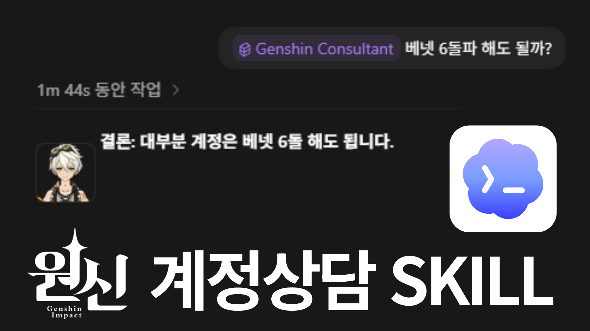

# Genshin Consultant

<div align="center">



**Codex용 원신 빌드 컨설팅 스킬**  
Screenshot-based Genshin Impact consulting skill for Codex  
面向 Codex 的原神角色养成与配队咨询 Skill


</div>

---

## 한국어

### 이 repo는 무엇인가요?

`genshin-consultant`는 Codex에서 사용하는 **원신 스크린샷 기반 빌드 컨설팅 스킬**입니다. 캐릭터 상세, 무기, 성유물, 특성, 별자리, 로스터 이미지를 읽고 현재 메타 자료를 확인한 뒤, 한국어 중심의 실전형 조언을 제공합니다.

주요 기능:

- 캐릭터 스탯, 무기, 성유물, 특성 상태 진단
- 치확/치피/원충/원마/HP/방어력 등 역할별 목표 스탯 제안
- 무기 랭킹, 성유물 대체안, 파티와 로테이션 추천
- 웹 출처 기반 최신 메타 검증
- 캐시된 캐릭터/무기/성유물 아이콘을 활용한 인라인 이미지 출력
- 요청 시 PNG 리포트 카드, 파티 카드, 무기 TOP 5 카드 생성

### 폴더 구조

```text
genshin-consultant/
  SKILL.md                 # Codex가 읽는 스킬 본문
  agents/openai.yaml       # 스킬 표시 이름과 기본 프롬프트
  references/              # 빌드 기준, 출처 정책, 출력 템플릿
  scripts/                 # 캐시 조회, 검증, 리포트 렌더링 도구
  assets/genshin-assets/   # 선택 사항: WebP 중심 로컬 이미지 캐시
```

### 설치

Codex 스킬 폴더에 `genshin-consultant` 디렉터리를 복사하거나 심볼릭 링크/정션으로 연결합니다.

```powershell
# Windows 예시
New-Item -ItemType Directory -Force "$env:USERPROFILE\.codex\skills"
Copy-Item -Recurse ".\genshin-consultant" "$env:USERPROFILE\.codex\skills\genshin-consultant"
```

개발 중에는 원본을 바로 연결하는 정션도 편합니다.

```powershell
cmd /c mklink /J "%USERPROFILE%\.codex\skills\genshin-consultant" "%CD%\genshin-consultant"
```

### 기본 사용법

Codex 대화에서 스킬을 직접 호출합니다.

```text
Use $genshin-consultant to analyze my Genshin screenshots.
```

한국어 요청 예시:

```text
$genshin-consultant 클로린드 상세정보, 무기, 성유물 스크린샷을 보고
현재 빌드 문제점, 목표 스탯, 무기 우선순위, 추천 파티 3개를 알려줘.
```

이미지 리포트가 필요할 때:

```text
$genshin-consultant 이 라이덴 빌드를 이미지 리포트 PNG로 만들어줘.
```

### 스킬 동작 방식

1. `SKILL.md`가 사용자 요청을 rich text 상담 또는 report mode로 분류합니다.
2. 스크린샷이 있으면 캐릭터/무기/성유물 값을 추출합니다.
3. `references/`의 기준표와 정책을 읽어 진단 기준을 맞춥니다.
4. 최신 메타가 필요한 내용은 웹 출처를 확인하고 인용합니다.
5. 일반 상담은 텍스트와 작은 아이콘으로 답변합니다.
6. 리포트 요청 시 `scripts/` 렌더러로 PNG 카드를 생성합니다.

### 에셋 캐시 형식

번들된 에셋 캐시는 repo 용량 효율을 위해 대부분의 원본 이미지를 WebP로 저장합니다. 캐릭터 카드, 무기 아이콘, 성유물 조각 아이콘, 성유물 세트 미리보기는 변환 후 더 커지는 일부 PNG 예외를 제외하고 WebP를 사용합니다. 성유물 세트 미리보기는 animated WebP일 수 있으며, 프레임을 줄이더라도 전체 재생 시간과 캔버스 크기는 보존합니다.

`assets/genshin-assets/current/thumbnails/` 아래의 생성된 썸네일은 의도적으로 PNG를 유지합니다. `query_asset_cache.py --thumb-size`는 Markdown 표, 일반 텍스트 상담, 리포트 메타데이터에서 안정적으로 쓰기 위한 작은 PNG 썸네일을 생성합니다.

### 스크립트 사용법

| Script | Purpose | Example |
|---|---|---|
| `build_asset_cache.py` | 캐릭터/무기/성유물 이미지 캐시 생성 | `python genshin-consultant/scripts/build_asset_cache.py --summary-only` |
| `query_asset_cache.py` | 캐시에서 이미지 경로 검색 | `python genshin-consultant/scripts/query_asset_cache.py "Raiden Shogun" --kind character --variant icon --thumb-size 48` |
| `optimize_asset_cache.py` | 캐시 이미지를 크기 효율적인 WebP로 변환하고 의도한 크기와 애니메이션 시간을 보존 | `python genshin-consultant/scripts/optimize_asset_cache.py --include-weapons --include-artifacts --artifact-frame-step 2 --apply` |
| `validate_consultation.py` | 상담 JSON 결과 검증 | `python genshin-consultant/scripts/validate_consultation.py result.json` |
| `localize_card_metadata.py` | 카드 메타데이터의 이름을 한국어로 변환 | `python genshin-consultant/scripts/localize_card_metadata.py card.json --in-place` |
| `fetch_card_assets.py` | 공식/wiki 이미지 에셋을 카드용으로 다운로드 | `python genshin-consultant/scripts/fetch_card_assets.py manifest.json` |
| `render_visual_card.py` | 파티/빌드/무기/성유물/메커니즘 카드 렌더링 | `python genshin-consultant/scripts/render_visual_card.py card.json` |
| `render_showcase_card.py` | 무기 TOP 5, 성유물 쇼케이스 카드 렌더링 | `python genshin-consultant/scripts/render_showcase_card.py showcase.json` |
| `render_party_list_card.py` | 추천 파티 목록 카드 렌더링 | `python genshin-consultant/scripts/render_party_list_card.py parties.json` |
| `render_html_report.py` | HTML/CSS 기반 고품질 빌드 리포트 렌더링 | `python genshin-consultant/scripts/render_html_report.py build.json` |
| `compose_visual_page.py` | 여러 PNG 카드를 하나의 세로 페이지로 합성 | `python genshin-consultant/scripts/compose_visual_page.py page.json` |

### 의존성

```powershell
python -m pip install pillow
python -m pip install playwright
python -m playwright install chromium
```

`Pillow`는 대부분의 PNG 카드 렌더링에 필요합니다. `Playwright`는 `render_html_report.py`에서 HTML 리포트를 PNG로 캡처할 때 사용됩니다.

### 업로드 전 권장 제외 항목

생성 결과물과 개인 작업 로그는 repo에 올리지 않는 것을 권장합니다.

```gitignore
.omx/
generated/
genshin-consultant/generated/
genshin-consultant/scripts/__pycache__/
genshin-consultant/.vscode/
*.pyc
*.log
*.jsonl
```

## English

### What is this repository?

`genshin-consultant` is a **Codex skill for screenshot-based Genshin Impact build consulting**. It inspects character, weapon, artifact, talent, constellation, roster, and inventory screenshots, checks current sources when needed, and returns practical build guidance.

Core capabilities:

- Diagnose character stats, weapons, artifacts, talents, and team fit
- Recommend role-specific targets for CRIT, ER, EM, HP, DEF, and other scaling stats
- Rank weapons, compare artifact sets, and suggest teams and rotations
- Verify meta-sensitive claims with cited web sources
- Attach cached local character, weapon, and artifact icons to rich text answers
- Generate optional PNG report cards, party cards, weapon TOP 5 cards, and artifact showcase cards

### Repository Layout

```text
genshin-consultant/
  SKILL.md                 # Main Codex skill instructions
  agents/openai.yaml       # Display name and default prompt
  references/              # Benchmarks, source policy, output templates
  scripts/                 # Cache lookup, validation, localization, renderers
  assets/genshin-assets/   # Optional local image cache, mostly WebP originals
```

### Installation

Copy the skill directory into your Codex skills folder.

```powershell
New-Item -ItemType Directory -Force "$env:USERPROFILE\.codex\skills"
Copy-Item -Recurse ".\genshin-consultant" "$env:USERPROFILE\.codex\skills\genshin-consultant"
```

For local development, a junction keeps the installed skill synced with this repo.

```powershell
cmd /c mklink /J "%USERPROFILE%\.codex\skills\genshin-consultant" "%CD%\genshin-consultant"
```

### Basic Usage

In a Codex conversation:

```text
Use $genshin-consultant to analyze my Genshin screenshots.
```

Example:

```text
$genshin-consultant Review my Clorinde screenshots and tell me the build issues,
target stats, weapon priority, artifact upgrades, and 3 recommended teams.
```

For image reports:

```text
$genshin-consultant Generate a PNG build report for this Raiden Shogun build.
```

### How the Skill Works

1. `SKILL.md` decides whether the request is rich text consulting or report mode.
2. Screenshot data is extracted into a structured character/build state.
3. `references/` provides benchmarks, source rules, tone, and output templates.
4. Current web sources are checked when meta-sensitive advice is needed.
5. Rich text answers include compact recommendations and optional cached icons.
6. Report mode uses `scripts/` to localize metadata and render PNG cards.

### Asset Cache Format

The bundled asset cache stores most source images as WebP for repository size efficiency. Character card art, weapon icons, artifact piece icons, and artifact-set previews are WebP unless a specific PNG source is smaller after comparison. Artifact-set previews may be animated WebP; their timing is preserved while redundant frames are reduced.

Generated thumbnails under `assets/genshin-assets/current/thumbnails/` intentionally remain PNG. `query_asset_cache.py --thumb-size` creates those PNG thumbnails as a stable small-image fallback for Markdown tables, rich text answers, and report metadata.

### Script Guide

| Script | Purpose | Example |
|---|---|---|
| `build_asset_cache.py` | Build the character, weapon, and artifact image cache | `python genshin-consultant/scripts/build_asset_cache.py --summary-only` |
| `query_asset_cache.py` | Find cached image paths | `python genshin-consultant/scripts/query_asset_cache.py "Raiden Shogun" --kind character --variant icon --thumb-size 48` |
| `optimize_asset_cache.py` | Convert cache images to size-efficient WebP while preserving intended dimensions and animation timing | `python genshin-consultant/scripts/optimize_asset_cache.py --include-weapons --include-artifacts --artifact-frame-step 2 --apply` |
| `validate_consultation.py` | Validate consultation JSON | `python genshin-consultant/scripts/validate_consultation.py result.json` |
| `localize_card_metadata.py` | Convert card metadata names into Korean display names | `python genshin-consultant/scripts/localize_card_metadata.py card.json --in-place` |
| `fetch_card_assets.py` | Fetch official/wiki assets for visual cards | `python genshin-consultant/scripts/fetch_card_assets.py manifest.json` |
| `render_visual_card.py` | Render party, build, weapon, artifact, and mechanics cards | `python genshin-consultant/scripts/render_visual_card.py card.json` |
| `render_showcase_card.py` | Render weapon TOP 5 and artifact showcase cards | `python genshin-consultant/scripts/render_showcase_card.py showcase.json` |
| `render_party_list_card.py` | Render ranked party recommendation cards | `python genshin-consultant/scripts/render_party_list_card.py parties.json` |
| `render_html_report.py` | Render polished HTML/CSS build reports | `python genshin-consultant/scripts/render_html_report.py build.json` |
| `compose_visual_page.py` | Combine several PNG cards into one vertical page | `python genshin-consultant/scripts/compose_visual_page.py page.json` |

### Dependencies

```powershell
python -m pip install pillow
python -m pip install playwright
python -m playwright install chromium
```

`Pillow` is required for most PNG renderers. `Playwright` is only needed when capturing HTML reports as PNG images.

### Recommended Ignore Rules

Generated artifacts and local logs should stay out of Git.

```gitignore
.omx/
generated/
genshin-consultant/generated/
genshin-consultant/scripts/__pycache__/
genshin-consultant/.vscode/
*.pyc
*.log
*.jsonl
```

## 中文

### 这个 repo 是什么？

`genshin-consultant` 是一个 **面向 Codex 的原神截图养成咨询 Skill**。它可以读取角色详情、武器、圣遗物、天赋、命座、角色池和武器库存截图，并在需要时结合最新资料，给出实战向的养成建议。

主要能力：

- 诊断角色面板、武器、圣遗物、天赋和队伍适配
- 给出暴击率、暴击伤害、充能、精通、生命、防御等目标面板
- 推荐武器排序、圣遗物替代方案、配队和循环
- 对版本环境相关结论进行网页资料核验并附来源
- 在普通文字咨询中插入本地缓存的角色、武器、圣遗物图标
- 按需生成 PNG 养成报告、配队卡、武器 TOP 5 卡和圣遗物展示卡

### 目录结构

```text
genshin-consultant/
  SKILL.md                 # Codex 读取的 Skill 主说明
  agents/openai.yaml       # 显示名称和默认提示词
  references/              # 面板基准、资料策略、输出模板
  scripts/                 # 缓存查询、校验、本地化、图片渲染工具
  assets/genshin-assets/   # 可选：本地图片缓存
```

### 安装

把 `genshin-consultant` 目录复制到 Codex skills 目录。

```powershell
New-Item -ItemType Directory -Force "$env:USERPROFILE\.codex\skills"
Copy-Item -Recurse ".\genshin-consultant" "$env:USERPROFILE\.codex\skills\genshin-consultant"
```

开发时也可以用 junction 直接连接原目录。

```powershell
cmd /c mklink /J "%USERPROFILE%\.codex\skills\genshin-consultant" "%CD%\genshin-consultant"
```

### 基本用法

在 Codex 对话中调用：

```text
Use $genshin-consultant to analyze my Genshin screenshots.
```

示例：

```text
$genshin-consultant 请根据我的克洛琳德角色、武器和圣遗物截图，
分析当前问题、目标面板、武器优先级、圣遗物升级方向，并推荐 3 个队伍。
```

需要图片报告时：

```text
$genshin-consultant 请把这个雷电将军配装生成 PNG 养成报告。
```

### Skill 工作流程

1. `SKILL.md` 判断请求是普通文字咨询还是报告模式。
2. 如果有截图，先整理角色、武器、圣遗物等结构化状态。
3. `references/` 提供面板基准、来源策略、语气和输出模板。
4. 涉及当前版本环境的建议会先查证网页资料。
5. 普通咨询输出简洁建议，并可附本地图标。
6. 报告模式会通过 `scripts/` 本地化数据并渲染 PNG 卡片。

### 脚本说明

| Script | 用途 | 示例 |
|---|---|---|
| `build_asset_cache.py` | 生成角色、武器、圣遗物图片缓存 | `python genshin-consultant/scripts/build_asset_cache.py --summary-only` |
| `query_asset_cache.py` | 查询缓存图片路径 | `python genshin-consultant/scripts/query_asset_cache.py "Raiden Shogun" --kind character --variant icon --thumb-size 48` |
| `validate_consultation.py` | 校验咨询 JSON | `python genshin-consultant/scripts/validate_consultation.py result.json` |
| `localize_card_metadata.py` | 将卡片元数据名称转换为韩文显示名 | `python genshin-consultant/scripts/localize_card_metadata.py card.json --in-place` |
| `fetch_card_assets.py` | 从官方/wiki 来源获取卡片图片素材 | `python genshin-consultant/scripts/fetch_card_assets.py manifest.json` |
| `render_visual_card.py` | 渲染配队、养成、武器、圣遗物和机制卡 | `python genshin-consultant/scripts/render_visual_card.py card.json` |
| `render_showcase_card.py` | 渲染武器 TOP 5 和圣遗物展示卡 | `python genshin-consultant/scripts/render_showcase_card.py showcase.json` |
| `render_party_list_card.py` | 渲染多队伍推荐卡 | `python genshin-consultant/scripts/render_party_list_card.py parties.json` |
| `render_html_report.py` | 渲染 HTML/CSS 高质量养成报告 | `python genshin-consultant/scripts/render_html_report.py build.json` |
| `compose_visual_page.py` | 将多张 PNG 卡片合成为一张长图 | `python genshin-consultant/scripts/compose_visual_page.py page.json` |

### 依赖

```powershell
python -m pip install pillow
python -m pip install playwright
python -m playwright install chromium
```

`Pillow` 用于大多数 PNG 卡片渲染。`Playwright` 只在把 HTML 报告截图成 PNG 时需要。

### 建议忽略的文件

生成物和本地日志不建议提交到 Git。

```gitignore
.omx/
generated/
genshin-consultant/generated/
genshin-consultant/scripts/__pycache__/
genshin-consultant/.vscode/
*.pyc
*.log
*.jsonl
```

---

## 법적 고지 및 책임 의무 (Fan-made / Unofficial)

### AI 판단 및 사용 책임 면책

이 프로젝트와 `genshin-consultant` 스킬이 제공하는 빌드 진단, 무기/성유물/파티 추천, 로테이션, 뽑기 조언, 리소스 투자 판단, 이미지 분석 결과, 웹 출처 요약 등은 AI가 생성하거나 보조한 참고 정보입니다.

사용자는 해당 정보를 최종 판단의 참고 자료로만 사용해야 하며, 실제 게임 플레이, 과금, 계정 운용, 콘텐츠 재배포, 제3자 자료 사용, 정책 준수 여부에 관한 결정은 전적으로 사용자 본인의 책임입니다.

본 프로젝트의 관리자 및 기여자는 AI 분석 결과의 정확성, 최신성, 완전성, 특정 목적 적합성, 게임 내 성능 향상, 계정 안전성, 외부 플랫폼 정책 준수 여부를 보증하지 않습니다. AI 판단을 신뢰하거나 적용하여 발생하는 손해, 손실, 계정 제재, 정책 위반, 권리 침해, 데이터 손상, 기회비용, 기타 직간접 결과에 대한 귀책사유는 법령상 허용되는 최대 범위에서 사용자 또는 해당 행위자 본인에게 있습니다.

### 팬메이드 비공식 프로젝트 고지

이 프로젝트는 팬메이드 비공식 Codex 스킬 및 원신 상담 보조 도구입니다.

`Genshin Impact`, `원신`, `HoYoverse`, `COGNOSPHERE`, `miHoYo` 및 관련 명칭, 로고, 캐릭터, 무기, 성유물, 게임 이미지, 게임 데이터, 기타 콘텐츠의 권리는 각 권리자에게 있습니다.

이 저장소는 공식 제품이 아니며, HoYoverse, COGNOSPHERE, miHoYo 또는 그 관계사와 제휴, 승인, 후원, 보증 관계가 없습니다.

본 프로젝트는 비상업적 목적의 팬 활동과 개인 학습/도구화 목적을 전제로 하며, 사용자는 본 프로젝트와 포함 리소스를 상업적 목적으로 사용해서는 안 됩니다.

본 프로젝트에 포함되거나 참조된 제3자 코드, 이미지, 데이터, 리소스, 문서, API, 라이브러리는 각 원저작자 및 해당 라이선스 조건을 따릅니다.

권리자 또는 대리인의 삭제, 수정, 비공개 요청이 접수될 경우, 관리자는 해당 콘텐츠를 지체 없이 제거하거나 비공개 처리할 수 있습니다. GitHub DMCA 또는 기타 권리침해 신고가 접수될 경우, 해당 플랫폼 정책과 관련 법령에 따라 즉각적인 조치를 취합니다.

사용자는 본 프로젝트 사용으로 발생할 수 있는 플랫폼 정책 위반, 저작권/상표권/초상권/기타 권리 침해 위험을 스스로 확인하고 책임져야 합니다.

### 면책 및 책임 범위

본 저장소는 "있는 그대로(AS IS)" 제공되며, 특정 목적 적합성, 정확성, 완전성, 지속적 동작, 무중단 제공, 오류 없음, 최신 게임 버전과의 호환성을 보증하지 않습니다.

사용자가 본 저장소를 다운로드, 설치, 실행, 수정, 재배포, 포크, 인용하거나 포함 리소스를 사용하는 과정에서 발생한 모든 결과(정책 위반, 권리 침해, 계정 제재, 데이터 손실, 금전적 손해, 법적 분쟁 포함)는 해당 사용자 또는 행위자 본인의 책임입니다.

저장소 관리자 및 기여자는 법령상 허용되는 최대 범위에서, 본 프로젝트 사용 또는 사용 불가로 인해 발생한 직간접적, 우발적, 특별, 결과적 손해에 대해 책임을 지지 않습니다.

제3자가 본 저장소를 재게시, 재배포, 수정 배포하거나 추가한 내용에 대한 법적 책임은 해당 게시자 또는 행위자에게 있으며, 원 저장소 관리자에게 자동 승계되지 않습니다.

### 권리자 문의 / 삭제 요청

권리자 또는 대리인은 아래 연락처로 삭제, 수정, 비공개 또는 권리 관련 요청을 보낼 수 있습니다.

Contact: axwhalesolution@gmail.com

권리자의 정당한 요청이 확인될 경우 즉각적인 조치(삭제/수정/비공개)를 진행합니다.
